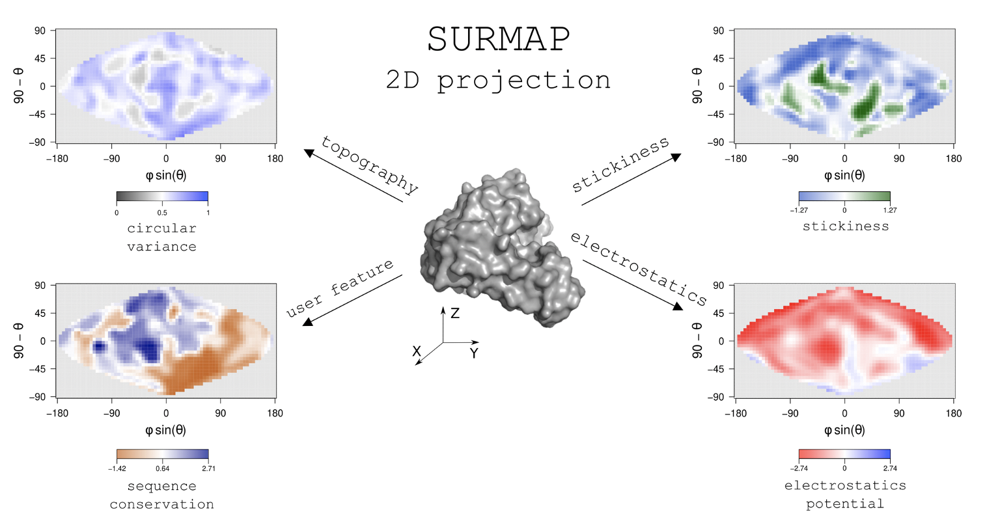

<div align="center">

  <a></a>
  <a></a>
  <a></a>
  <a></a>
  <a></a>


  
  
  <br>

  <!-- 
  
  
   -->
</div>

<br>

# SURFMAP

<div align="center">
    
</div>


# Table of contents

- [Aims](#Aims)
- [Preamble](#Preamble)
- [Download](#Download)
- [Installation](#Installation)
- [Usage of SURFMAP](#Usage-of-SURFMAP)
- [How to cite SURFMAP](#How-to-cite-SURFMAP)


# Aims
[Go to the top](#Table-of-contents)

<div>


SURFMAP is a free standalone and easy-to-use command-line interface (CLI) software that enables the fast and automated 2-D projection of either predefined features of protein surface (electrostatic potential, Kyte-Doolittle hydrophobicity, Wimley-White hydrophobicity, stickiness and surface relief) or any descriptor encoded in the temperature factor column of a PDB file. The 2-D maps computed by SURFMAP can be used to analyze and/or compare protein surface properties.
</div>


# Installation
[Go to the top](#Table-of-contents)

SURFMAP is a CLI tool that requires a UNIX-based OS system. It is written in python (version 3.7), R (version 3.6) and bash. It relies on the already included MSMS software (1) and may optionally require APBS (2) if the user wants to perform electrostatics calculations. 

All those requirements (including APBS) are fullfilled in a [**pre-built Docker image**](https://hub.docker.com/r/lopesi2bc/surfmap) that we recommend the user to use. If you don't want to use Docker, SURFMAP can be installed locally on your computer. See below the requirements for each case.

### Requirements

<details>
<summary>For a usage of the docker image</summary>

- an UNIX-based OS system (any linux distribution, a MacOS system or [WSL2](https://learn.microsoft.com/fr-fr/windows/wsl/install) on windows)
- [Python >= 3.7](https://www.python.org/downloads)
- [Docker](https://docs.docker.com/get-docker/)
- the SURFMAP docker image: `docker pull lopesi2bc/surfmap`

</details>

<details>
<summary>For a local install</summary>

- an UNIX-based OS system (any linux distribution, a MacOS system or [WSL2](https://learn.microsoft.com/fr-fr/windows/wsl/install) on windows)
- [Python >= 3.7](https://www.python.org/downloads)
- [R >= 3.6](https://cran.r-project.org/)
- [APBS](https://github.com/Electrostatics/apbs/releases) (optional - only if you want to compute electrostatics potential)
 
</details>

#### Notes

1. You will still need to install the SURFMAP package on your machine to use the [**pre-built Docker image**](https://hub.docker.com/r/lopesi2bc/surfmap).
2. We strongly recommend that you install the SURFMAP package and its python dependencies in an isolated environment. Click in the section below for a short illustration on why and how to use an isolated environment.

<details>
<summary>How to use an isolated environment (recommended)</summary>
<br>
<p>
By using an isolated environment you'll avoid potential version conflicts between python libraries when working on different projects. Some of the most popular tools to work with isolated python environments are [virtualenv](https://pypi.org/project/virtualenv/), [pyenv](https://pypi.org/project/pyenv/), [pipenv](https://pypi.org/project/pipenv/). 
</p>

Below is an example on how to use [virtualenv](https://pypi.org/project/virtualenv/).

#### 1. Install virutalenv
```bash
# upgrade pip to its latest version
python3 -m pip install --upgrade pip

# install virtualenv
python3 -m pip install virtualenv
```

#### 2. Create and activate an isolated environment
```bash
# create an isolated environment named 'myenv' (to adapt)
virtualenv myenv

# activate your isolated environment
source myenv/bin/activate
```

Once activated, any python library you'll install using pip will be installed in this isolated environment, and python will only have access to these packages.

Once you're done working on your project, simply type `deactivate` to exit the environment.
</details>


## How to install SURFMAP

### From this project repository

```bash
# clone SURFMAP on your machine
git clone https://github.com/i2bc/SURFMAP.git

# go in the SURFMAP/ directory
cd SURFMAP

# upgrade pip to its latest version
python3 -m pip install --upgrade pip

# install SURFMAP
python3 -m pip install -e .
```

### From the archive
First download an archive of our latest release <a href="https://github.com/i2bc/SURFMAP/releases/latest" target="_blank">here</a>.

```bash
# upgrade pip to its latest version
python3 -m pip install --upgrade pip

# install SURFMAP
python3 -m pip install SURFMAP-v2.0.0.zip (or .tar.gz)</code>
```

### From the version control systems

```bash
# upgrade pip to its latest version
python3 -m pip install --upgrade pip

# install SURFMAP
python -m pip install -e git+https://github.com/i2bc/SURFMAP.git@v2.0.0#egg=surfmap</code>
```

# Usage of SURFMAP
[Go to the top](#Table-of-contents)


<!-- <details>
<summary><h3>Use of the docker image with the <code>--docker</code> option</h3></summary>

Since the version 2.0.0, wether you want to use SURFMAP from a Docker container or from a local install, the same command-line interface has to be used (`surfmap -h`). The difference is that for running SURFMAP on a container (recommended way) you just have to add the `--docker` as an extra argument to the other required/optional basic arguments.

The reason is that we have managed the CLI usage so that it is called in exactly the same way wether you use SURFMAP from a local install or through its Docker image. Concretely, when using the Docker image, you will not have to deal with volumes binding; all you'll have to do is simply add the `--docker` option in your command.

</details> -->

## Generate a 2D map of protein surface features

### From a predefined features

### From a predefined features


Map the  protein surface features and to map them on a 2D plan through a projection. The user has the choice between three different projections:


# How to cite SURFMAP
[Go to the top](#Table-of-contents)

If SURFMAP has been useful to your research, please cite us as well as the original MSMS paper:

> Hugo Schweke, Marie-Hélène Mucchielli, Nicolas Chevrollier, Simon Gosset, Anne Lopes. SURFMAP: a software for mapping in two dimensions protein surface features. J. Chem. Inf. Model. 2022. doi: 10.1021/acs.jcim.1c01269

> Sanner MF, Olson AJ, Spehner JC. Reduced surface: an efficient way to compute molecular surfaces. Biopolymers. 1996 Mar;38(3):305-20. doi: 10.1002/(SICI)1097-0282(199603)38:3%3C305::AID-BIP4%3E3.0.CO;2-Y. PMID: 8906967. https://doi.org/10.1002/(sici)1097-0282(199603)38:3%3c305::aid-bip4%3e3.0.co;2-y

<br>

Moreover, if you use APBS in your research, please cite one or more of the following papers listed in the [Supporting APBS](https://apbs.readthedocs.io/en/latest/supporting.html) documentation page.
<br>

# References
[Go to the top](#Table-of-contents)

(1) Michel Sanner, Arthur J. Olson, Jean Claude Spehner (1996). Reduced Surface: an Efficient Way to Compute Molecular Surfaces. Biopolymers, Vol 38, (3), 305-320.

(2) Jurrus E, Engel D, Star K, Monson K, Brandi J, Felberg LE, Brookes DH, Wilson L, Chen J, Liles K, Chun M, Li P, Gohara DW, Dolinsky T, Konecny R, Koes DR, Nielsen JE, Head-Gordon T, Geng W, Krasny R, Wei GW, Holst MJ, McCammon JA, Baker NA. Improvements to the APBS biomolecular solvation software suite. Protein Science, 27, 112-128, 2018.
