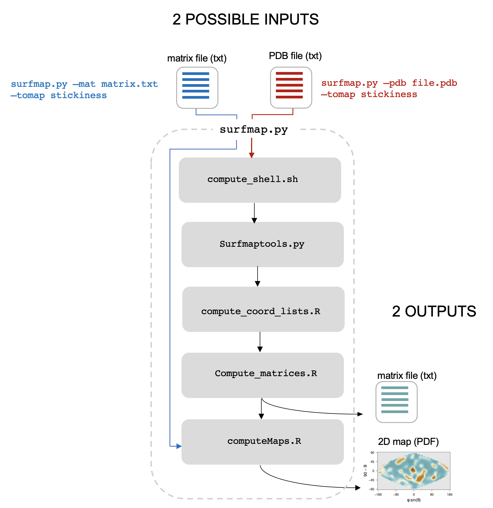

<div align="center">

  <a></a>
  <a></a>
  <a></a>
  <a></a>
  <a></a>


  
  
  <br>

  <!-- 
  
  
   -->
</div>

<br>

# SURFMAP

<div align="center">
    
</div>


# Table of contents

- [Aims](#Aims)
- [Preamble](#Preamble)
- [Download](#Download)
- [Installation](#Installation)
- [Usage of SURFMAP](#Usage-of-SURFMAP)
- [How to cite SURFMAP](#How-to-cite-SURFMAP)


# Aims
[Go to the top](#Table-of-contents)

<div>


SURFMAP is a free standalone and easy-to-use command-line interface (CLI) software that enables the fast and automated 2-D projection of either predefined features of protein surface (electrostatic potential, Kyte-Doolittle hydrophobicity, Wimley-White hydrophobicity, stickiness and surface relief) or any descriptor encoded in the temperature factor column of a PDB file. The 2-D maps computed by SURFMAP can be used to analyze and/or compare protein surface properties.
</div>


# Installation
[Go to the top](#Table-of-contents)

SURFMAP is a CLI tool that requires a UNIX-based OS system. It is written in python (version 3.7), R (version 3.6) and bash. It relies on the already included MSMS software (1) and may optionally require APBS (2) if the user wants to perform electrostatics calculations. 

All those requirements (including APBS) are fullfilled in a [**pre-built Docker image**](https://hub.docker.com/r/lopesi2bc/surfmap) that we recommend the user to use. If you don't want to use Docker, SURFMAP can be installed locally on your computer. See below the requirements for each case.

### Requirements

<details>
<summary>For a usage of the docker image</summary>

- an UNIX-based OS system (any linux distribution, a MacOS system or [WSL2](https://learn.microsoft.com/fr-fr/windows/wsl/install) on windows)
- [Python >= 3.7](https://www.python.org/downloads)
- [Docker](https://docs.docker.com/get-docker/)
- the SURFMAP docker image: `docker pull lopesi2bc/surfmap`

</details>

<details>
<summary>For a local install</summary>

- an UNIX-based OS system (any linux distribution, a MacOS system or [WSL2](https://learn.microsoft.com/fr-fr/windows/wsl/install) on windows)
- [Python >= 3.7](https://www.python.org/downloads)
- [R >= 3.6](https://cran.r-project.org/)
- [APBS](https://github.com/Electrostatics/apbs/releases) (optional - only if you want to compute electrostatics potential)
 
</details>

#### Notes

1. You will still need to install the SURFMAP package on your machine to use the [**pre-built Docker image**](https://hub.docker.com/r/lopesi2bc/surfmap).
2. We strongly recommend that you install the SURFMAP package and its python dependencies in an isolated environment. Click in the section below for a short illustration on why and how to use an isolated environment.

<details>
<summary>How to use an isolated environment (recommended)</summary>

<p>
By using an isolated environment you'll avoid potential version conflicts between python libraries when working on different projects. Some of the most popular tools to work with isolated python environments are [virtualenv](https://pypi.org/project/virtualenv/), [pyenv](https://pypi.org/project/pyenv/), [pipenv](https://pypi.org/project/pipenv/). 
</p>

Below is an example on how to use [virtualenv](https://pypi.org/project/virtualenv/).

#### 1. Install virutalenv
```bash
# upgrade pip to its latest version
python3 -m pip install --upgrade pip

# install virtualenv
python3 -m pip install virtualenv
```

#### 2. Create and activate an isolated environment
```bash
# create an isolated environment named 'myenv' (to adapt)
virtualenv myenv

# activate your isolated environment
source myenv/bin/activate
```

Once activated, any python library you'll install using pip will be installed in this isolated environment, and python will only have access to these packages.

Once you're done working on your project, simply type `deactivate` to exit the environment.
</details>


## How to install SURFMAP

<details>
<summary><h3>From this project repository</h3></summary>

```bash
# clone SURFMAP on your machine
git clone https://github.com/i2bc/SURFMAP.git

# go in the SURFMAP/ directory
cd SURFMAP

# install SURFMAP
python3 -m pip install -e .
```
</details>


<details>
<summary><h3>From the archive</h3></summary>
First download an archive of our latest release <a href="https://github.com/i2bc/SURFMAP/releases/latest" target="_blank">here</a>.

<pre>
<code class="bash language-bash"><span style="color: green"># upgrade pip to its latest version</span>
python3 -m pip install --upgrade pip

<span style="color: green"># install SURFMAP (an isolated environment is recommended)</span>
python3 -m pip install SURFMAP-v2.0.0.zip (or .tar.gz)</code>
</pre>
</details>


<details>
<summary><h3>From the version control systems</h3></summary>

<pre>
<code class="bash language-bash"><span style="color: green"># upgrade pip to its latest version</span>
python3 -m pip install --upgrade pip

<span style="color: green"># install surfmap (an isolated environment is recommended)</span>
python -m pip install -e git+https://github.com/i2bc/SURFMAP.git@v2.0.0#egg=surfmap</code>
</pre>
</details>


# Usage of SURFMAP
[Go to the top](#Table-of-contents)


<details>
<summary><h3>Use of the docker image with the <code>--docker</code> option</h3></summary>

Since the version 2.0.0, wether you want to use SURFMAP from a Docker container or from a local install, the same command-line interface has to be used (`surfmap -h`). The difference is that for running SURFMAP on a container (recommended way) you just have to add the `--docker` as an extra argument to the other required/optional basic arguments.

The reason is that we have managed the CLI usage so that it is called in exactly the same way wether you use SURFMAP from a local install or through its Docker image. Concretely, when using the Docker image, you will not have to deal with volumes binding; all you'll have to do is simply add the `--docker` option in your command.

</details>


**Note**: 

If you followed the steps above, SURFMAP should be ready to use through the script `surfmap.py` (manual installation) or `run_surmap_image.py` (docker installation). In the following section, we assume SURFMAP is callable as `surfmap`, an [alias](#tip) of either `run_surfmap_image.py` or `surfmap.py`.

To guide the user on how to use SURFMAP, we will use files in the `example/` directory that can be found in the downloaded SURFMAP project:

<pre><font color="#3465A4"><b>example/</b></font>
├── 1g3n_A.pdb
├── 1gv3_A_binding_sites.pdb
├── <font color="#3465A4"><b>example_1g3n_A_stickiness/</b></font>
├── <font color="#3465A4"><b>example_1g3n_A_stickiness_allfiles/</b></font>
├── <font color="#3465A4"><b>example_1g3n_A_stickiness_mapping_residues/</b></font>
├── <font color="#3465A4"><b>example_1gv3_A_stickiness_binding_sites/</b></font>
├── <font color="#3465A4"><b>example_mapping_stickiness/</b></font>
├── README
└── residues_to_map.txt
</pre>

## SURFMAP inputs and outputs

SURFMAP allows to compute different protein surface features and to map them on a 2D plan through a projection. The user has the choice between three different projections:
- Sinusoidal, also known as Samson-Flamsteed (the default projection): pseudocylindrical equal-area map projection.
- Lambert cylindrical: cylindrical equal-area map projection; equally spaced straight meridians; true scale on the equator.
- Mollweide: equal-area, pseudocylindrical map projection onto 2-to-1 ellipse.


The user can provide two different inputs (a pdb file or a matrix file) through the two exclusive arguments `-pdb` and `-mat` respectively (see figure below). (i) a PDB file (with the arg -pdb). In this case, SURFMAP calculates and produces the resulting 2D matrix (text file that can be further processed by the user himself as desired - e.g., normalize, average with other comparable matrices etc), and generates the corresponding 2D map (PDF file). (ii) the user can directly provide SURFMAP with a matrix text file (with the arg -mat) that has been processed as desired and which follows the matrix format generated by SURFMAP. In this case, SURFMAP generates the corresponding 2D map (PDF or PNG) for visualization.

<p align="center">
  
</p>


### SURFMAP `-pdb` option

- the `-pdb` argument must be followed by the protein structure whose surface is to be analyzed in a PDB format. 
- the `-tomap` argument must be followed by a keyword representing the protein surface feature the user wants to map.
The user can also use the option `all` to map the Kyte-Doolittle hydrophobicity, the Wimley-White hydrophobicity, the stickiness and the circular variance per residue at the same time. The available keywords are listed below (see SURFMAP_manual.pdf in `doc/` or the original article for a description):
  - wimley_white
  - kyte_doolittle
  - stickiness
  - circular_variance
  - circular_variance_atom
  - electrostatics
  - bfactor
  - binding_sites
  - all

For instance, the following command line will map the stickiness protein surface feature for the chain A of the protein [1G3N](https://www.rcsb.org/structure/1G3N):

```bash
# Considering we are in SURFMAP/example/ and surfmap is an alias of either surfmap.py or run_surfmap_image.py
surfmap -pdb example/1g3n_A.pdb -tomap stickiness
```

The above command will calculate the stickiness of the surface of 1g3n, project the resulting value in two dimensions and will generate an output directory named `output_SURFMAP_1g3n_A_stickiness/` with the following content:

<pre><font color="#3465A4"><b>output_SURFMAP_1g3n_A_stickiness/</b></font>
├── log_parameters
├── <font color="#3465A4"><b>maps/</b></font>
│   └── 1g3n_A_stickiness_map.pdf
└── <font color="#3465A4"><b>smoothed_matrices/</b></font>
    └── 1g3n_A_stickiness_smoothed_matrix.txt
</pre>

with:
- `log_parameters`: a summary of the basic parameters used to compute the map
- `1g3n_A_stickiness_sinusoidal_map.pdf`: the generated 2D map in pdf format
- `1g3n_A_stickiness_smoothed_matrix.txt`: a computed smoothed matrix file (txt file) used to generate the 2D map. This matrix has the expected format of a matrix file that can be used as a direct input of SURFMAP through the used of the `-mat` argument.

### SURFMAP `-mat` option

Alternatively, the user can provide a `-mat` argument instead of `-pdb`. In that case the user provides a matrix file computed for a property that must be given with the `-tomap` argument. SURFMAP will then generate the corresponding 2D map graphic in pdf format (by default) from it. Be careful with this option, as the matrix must be in the correct format used by SURFMAP. The main use of this option is to compute maps from 'customized' matrices. For example the user can create a map with SURFMAP for the same protein in different conformational states, and then create an "averaged" matrix for all the matrices and plot it with the option `-mat`.

As an example, the following command will generate a 2D graphic map corresponding to the averaged_matrix.txt file: 
```
surfmap -mat averaged_matrix.txt -tomap stickiness
```

The above command will generate an output directory named `output_SURFMAP_averaged_matrix_stickiness/` with the following content:

<pre><font color="#3465A4"><b>output_SURFMAP_averaged_matrix_stickiness/</b></font>
├── log_parameters
├── <font color="#3465A4"><b>maps/</b></font>
│   └── averaged_matrix_stickiness_map.pdf
└── <font color="#3465A4"><b>smoothed_matrices/</b></font>
    └── averaged_matrix_stickiness_smoothed_matrix.txt
</pre>


## SURFMAP optional parameters

The following table lists the optional parameters that can be used when running SURFMAP:

| Optional parameters | Description |
| --- | --- |
| -proj | Type of map projection (choices: `flamsteed`, `mollweide`, `lambert` - default: sinusoidal) |
| -mat | Input matrix. If the user gives an input matrix, SURFMAP will directly compute a map from it. |
| -res | File containing a list of residues to map on the projection |
| -rad | Radius added to the usual atomic radius used to calculate the solvent excluded surface. The higher the radius the smoother the surface (default: 3.0 Angström) |
| -d | Output directory where all files will be written (default: './output_SURFMAP_$pdb_$tomap' where $pdb and $tomap are the inputs given to `-pdb` and `-tomap` arguments, respectiveley) |
| -s | Size of a grid cell. Necessary that 180%cellsize == 0 (default: 5) |
| --nosmooth | If chosen, the resulted maps are not smoothed (careful: this option should be used only for discrete values!) |
| --png | If chosen, a map in png format is computed (default: only pdf format is generated) |
| --keep | If chosen, all intermediary files are kept in the output (default: only final text matrix and pdf map are kept) |

<br>

# Interactive viewer

All maps generated with SURFMAP can be interactively inspected with the help of an `index.html` file located in `SURFMAP/viewer/`.

To interactively visualize a map:
- open `index.html` in your favorite browser
- upload a smoothed matrix file (in the directory `smoothed_matrices` from an output generated with SURFMAP)

Once the map appears, you can hover over a pixel to see the corresponding residue(s) and its property value.


# How to cite SURFMAP
[Go to the top](#Table-of-contents)

If SURFMAP has been useful to your research, please cite us as well as the original MSMS paper:

> Hugo Schweke, Marie-Hélène Mucchielli, Nicolas Chevrollier, Simon Gosset, Anne Lopes. SURFMAP: a software for mapping in two dimensions protein surface features. J. Chem. Inf. Model. 2022. doi: 10.1021/acs.jcim.1c01269

> Sanner MF, Olson AJ, Spehner JC. Reduced surface: an efficient way to compute molecular surfaces. Biopolymers. 1996 Mar;38(3):305-20. doi: 10.1002/(SICI)1097-0282(199603)38:3%3C305::AID-BIP4%3E3.0.CO;2-Y. PMID: 8906967. https://doi.org/10.1002/(sici)1097-0282(199603)38:3%3c305::aid-bip4%3e3.0.co;2-y

<br>

Moreover, if you use APBS in your research, please cite one or more of the following papers listed in the [Supporting APBS](https://apbs.readthedocs.io/en/latest/supporting.html) documentation page.
<br>
<br>

# References
[Go to the top](#Table-of-contents)

(1) Michel Sanner, Arthur J. Olson, Jean Claude Spehner (1996). Reduced Surface: an Efficient Way to Compute Molecular Surfaces. Biopolymers, Vol 38, (3), 305-320.

(2) Jurrus E, Engel D, Star K, Monson K, Brandi J, Felberg LE, Brookes DH, Wilson L, Chen J, Liles K, Chun M, Li P, Gohara DW, Dolinsky T, Konecny R, Koes DR, Nielsen JE, Head-Gordon T, Geng W, Krasny R, Wei GW, Holst MJ, McCammon JA, Baker NA. Improvements to the APBS biomolecular solvation software suite. Protein Science, 27, 112-128, 2018.
