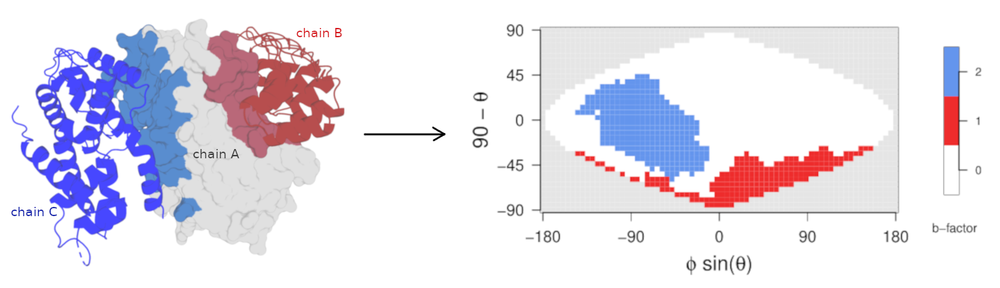

<div align="center">

  <a></a>
  <a></a>
  <a></a>
  <a></a>
  <a></a>


  
  
  <!-- <br> -->

  <!-- 
  
  
   -->
</div>

---

# SURFMAP

<div align="center">
    
</div>

# Table of contents

- [Aims](#Aims)
- [Preamble](#Preamble)
- [Download](#Download)
- [Installation](#Installation)
- [Usage of SURFMAP](#Usage-of-SURFMAP)
- [How to cite SURFMAP](#How-to-cite-SURFMAP)

# Aims
[Go to the top](#Table-of-contents)

<div>


SURFMAP is a free standalone and easy-to-use command-line interface (CLI) software that enables the fast and automated 2-D projection of either predefined features of protein surface (electrostatic potential, Kyte-Doolittle hydrophobicity, Wimley-White hydrophobicity, stickiness and surface relief) or any descriptor encoded in the temperature factor column of a PDB file. The 2-D maps computed by SURFMAP can be used to analyze and/or compare protein surface properties.
</div>


# Installation
[Go to the top](#Table-of-contents)

SURFMAP is a CLI tool that requires a UNIX-based OS system. It is written in python (version 3.7), R (version 3.6) and bash. It relies on the already included MSMS software (1) and may optionally require APBS (2) if the user wants to perform electrostatics calculations. 

All those requirements (including APBS) are fullfilled in a [**pre-built Docker image**](https://hub.docker.com/r/lopesi2bc/surfmap) that we recommend the user to use. If you don't want to use Docker, SURFMAP can be installed locally on your computer. See below the requirements for each case.

### Requirements

<details>
<summary><b>For a usage of the docker image</b></summary>

- an UNIX-based OS system (any linux distribution, a MacOS system or [WSL2](https://learn.microsoft.com/fr-fr/windows/wsl/install) on windows)
- [Python >= 3.7](https://www.python.org/downloads)
- [Docker](https://docs.docker.com/get-docker/)
- the SURFMAP docker image: `docker pull lopesi2bc/surfmap`

</details>

<details>
<summary><b>For a local install</b></summary>

- an UNIX-based OS system (any linux distribution, a MacOS system or [WSL2](https://learn.microsoft.com/fr-fr/windows/wsl/install) on windows)
- [Python >= 3.7](https://www.python.org/downloads)
- [R >= 3.6](https://cran.r-project.org/)
- [APBS](https://github.com/Electrostatics/apbs/releases) (optional - only if you want to compute electrostatic potential)
 
</details>

#### Notes

1. You will still need to install the SURFMAP package on your machine to use the [**pre-built Docker image**](https://hub.docker.com/r/lopesi2bc/surfmap).
2. We strongly recommend that you install the SURFMAP package and its python dependencies in an isolated environment. Click in the section below for a short illustration on why and how to use an isolated environment.

<details style="margin-left: 32px">
<summary>How to use an isolated environment (recommended)</summary>
<br>
<p>
By using an isolated environment you'll avoid potential version conflicts between python libraries when working on different projects. Some of the most popular tools to work with isolated python environments are [virtualenv](https://pypi.org/project/virtualenv/), [pyenv](https://pypi.org/project/pyenv/), [pipenv](https://pypi.org/project/pipenv/). 
</p>

Below is an example on how to use [virtualenv](https://pypi.org/project/virtualenv/).

#### 1. Install virtualenv
```bash
# upgrade pip to its latest version
python3 -m pip install --upgrade pip

# install virtualenv
python3 -m pip install virtualenv
```

#### 2. Create and activate an isolated environment
```bash
# create an isolated environment named 'myenv' (to adapt)
virtualenv myenv

# activate your isolated environment
source myenv/bin/activate
```

Once activated, any python library you'll install using pip will be installed in this isolated environment, and python will only have access to these packages.

Once you're done working on your project, simply type `deactivate` to exit the environment.
</details>


## How to install SURFMAP
Choose option 1 or 2 if you're not interested in accessing/modifying the source code, otherwise prefer option 3. 

#### Option 1: from the archive (git not required)
First download an archive of our latest release <a href="https://github.com/i2bc/SURFMAP/releases/latest" target="_blank">here</a>.

```bash
# upgrade pip to its latest version
python3 -m pip install --upgrade pip

# install SURFMAP v2.0.0
python3 -m pip install SURFMAP-v2.0.0.zip # (or .tar.gz) 
```

#### Option 2: from the version control systems

```bash
# upgrade pip to its latest version
python3 -m pip install --upgrade pip

# install SURFMAP v2.0.0
python -m pip install -e git+https://github.com/i2bc/SURFMAP.git@v2.0.0#egg=surfmap
```

#### Option 3: from this project repository

```bash
# clone SURFMAP on your machine
git clone https://github.com/i2bc/SURFMAP.git

# go in the SURFMAP/ directory
cd SURFMAP

# upgrade pip to its latest version
python3 -m pip install --upgrade pip

# install SURFMAP
python3 -m pip install -e .
```


# Usage of SURFMAP
[Go to the top](#Table-of-contents)

<details>
<summary><h4>The example directory</h4></summary>

To illustrate the usage of SURFMAP, we'll make use of files that you can find in the `example/` directory of SURFMAP. You can see where it is located with the following command:

```bash
python3 -c "import surfmap; print(surfmap.PATH_TO_EXAMPLES)"
```
</details>

<details>
<summary><h4>Run SURFMAP on a container or locally</h4></summary>

All command examples will make use of the docker image of SURFMAP thanks to the CLI option `--docker`. If you want to use SURFMAP through a local install, then simply remove this option.

```bash
# a command that will run on a docker container
surfmap -pdb foo.pdb -tomap stickiness --docker

# the same command that will run locally
surfmap -pdb foo.pdb -tomap stickiness
```
</details>


## Projection of a protein surface feature on a 2D map

In order to generate a 2D map, two inputs are required:
- either a PDB file (`-pdb` option) OR a SURFMAP matrix file (`-mat` option)
- a valid key referring to a feature to map:
  - `kyte_doolittle`
  - `wimley_white`
  - `stickiness`
  - `circular_variance`
  - `circular_variance_atom`
  - `electrostatics` (requires APBS)
  - `bfactor`
  - `all` (to compute)

### From a PDB structure `-pdb`

```bash
# example - command to map the stickiness values for residues at the surface of the chain A of 1g3n.pdb
surfmap -pdb 1g3n_A.pdb -tomap stickiness --docker
```

The output has the following structure and content:
<pre><font color="#12488B"><b>output_SURFMAP_1g3n_A_stickiness/</b></font>
├── <font color="#12488B"><b>maps</b></font>
│   └── 1g3n_A_stickiness_map.pdf
├── parameters.log
└── <font color="#12488B"><b>smoothed_matrices</b></font>
    └── 1g3n_A_stickiness_smoothed_matrix.txt
</pre>

with:
- `parameters.log`: a summary of the parameters used to compute the map
- `1g3n_A_stickiness_map.pdf`: the generated 2D map in pdf format
- `1g3n_A_stickiness_smoothed_matrix.txt`: a computed smoothed matrix file (txt file) used to generate the 2D map. This matrix has the expected format of a matrix file that can be used as a direct input of SURFMAP through the used of the `-mat` argument.


### From a SURFMAP matrix file `-mat`

A SURFMAP matrix file can also be used as an input to generate a 2D map. The feature to map has to be the same as the one used to generate the matrix file. As a fancy usage example, the command below will reproduce the 2D map generated from the command above:

```bash
# example - command to create a map from a SURFMAP matrix file generated with stickiness values
surfmap -mat output_SURFMAP_1g3n_A_stickiness/smoothed_matrices/1g3n_A_stickiness_smoothed_matrix.txt -tomap stickiness --docker
```

A more realistic usage of this option is to compute maps from your own customized matrices. For example you can create maps of a same protein in different conformational states. In this case, you may want to compute an averaged matrix file (please note that we don't provide such script utilities). The `-mat` option could then be used to generate a 2D map of this averaged matrix.


## Projection of a set of residues on a 2D map

<div align="center">
    
</div>

<object data="./doc/custom/project_binding_site.svg" type="image/svg+xml">
  
  <div class="container">test</div>
</object>

<figure style="border: 1px solid lightgray; padding: 2px 12px">



<figcaption align="center" style="font-size: 12px; text-align: justify; padding: 8px 8px">
<b style="font-size: 13px">Projection on a 2D map of the chain A interface residues of 1G3N.</b>

<div>
On the left side, the chains B and C of 1G3N are represented as a cartoon, in red and blue respectively. The 3D structure of the chain A of 1G3N is represented  as a surface in gray. Interface residues of the chain A are colored as the chain they interact with.
</div>

<div>
On the right side is the corresponding 2D maps representing the projection of interface residues of the chain A, with each interface following the same color scheme as the one used on the left side.
</div>

<details style="margin-top: 4px">
<summary><b>Show commands</b></summary>

```bash
# generate a PDB file of the chain A in which the b-factor column will contain a discrete value for each different interface residues that will be found 
extract_interface -pdb 1g3n_ABC.pdb -chains A

# Use the PDB file generated with the command above to project labelled residues on a 2D map 
surfmap -pdb 1g3n_ABC_chain-A_bs.pdb -tomap binding_sites
```
</details>


</figcaption>

</figure>


SURFMAP allows to map interface residues of a protein with the option `-tomap binding_sites`. This specific option requires that the PDB file is filled with discrete values in the b-bactor column:
- `0` for atoms that are not part of any binding sites
- `1` for atoms being part of one known binding site
- `2` for atoms being part of a second binding site (if there is)
- etc

Such a pre-edited file is present in the example directory. Below is the command to map its known binding site:
```bash
# example - command to create a map from a SURFMAP matrix file generated with stickiness values
surfmap -pdb 1gv3_A_binding_sites.pdb -tomap binding_sites
```

As shown below, we provide two utility scripts to help users working with maps related to the `-tomap binding_sites` option.


### Utility command to extract interface residues

The SURFMAP package includes a command called `extract_interface` that, given a multi-chain PDB file, allows to identify the interface residues between a (set of) chain(s), and all the other chains of the PDB structure. The output of the command is a PDB file of the given (set of) chain(s) ready for use by `surfmap` with the option `-tomap binding_sites`.

As an illustration, the PDB file `1g3n_ABC.pdb` in the example directory is made of the three chains A, B and C where A interacts with both the chains B and C. We can use `extract_interface` to identify the residues of the chain A at the interface of all other chains. Interface residues between the chains A and B will constitue one binding site; and interface residues between A and C will constitute a second binding site.
```bash
# identify residues at the interface of the chain A and all other chains: interface residues between chains A-B, and chains A-C
extract_interface -pdb 1g3n_ABC.pdb -chains A
```

The command will generate two output files:
- `1g3n_ABC_chain-A_bs.pdb`: a PDB file ready for use by `surfmap` with the option `-tomap binding_sites`.
- `1g3n_ABC_chain-A_interface.txt`: a text file containing information about identified interface residues. This file can be edited and used as input for the command `write_pdb_bs` described below.


### Utility command to edit a PDB file from known interface residues

In case you have a list of residues you want to map with the option `-tomap binding_sites` but these residues cannot be identified by `extract_interface`, we provide the utility command `write_pdb_bs` to help users in labelling the b-factor column of a PDB file ready for use by `surfmap` with the option `-tomap binding_sites`.

The command `write_pdb_bs` takes as inputs a PDB file to "edit" and a text file that must be formatted as follows:
- 1st column: the chain name that has an interface residue
- 2nd column: a residue ID
- 3rd column: a residue name
- 4th column: a discrete value (one value per different binding site)

For instance, if you want to map the residues GLU-14 and CYS-15 of the chain A as part of an interface, and the residues GLY-50 and GLU-51 of the chain A as part of another interface, you should create your input file as follows:
```
A	14	GLU	1
A	15	CYS	1
A	50	GLY	1
A	17	GLU	1
```

As a fancy example, the command below will reproduce the PDB file `1g3n_ABC_chain-A_bs.pdb` ready for use by `surfmap` with the option `-tomap binding_sites`:
```bash
write_pdb_bs -pdb 1g3n_ABC_chain-A_bs.pdb -res 1g3n_ABC_chain-A_interface.txt
```


# How to cite SURFMAP
[Go to the top](#Table-of-contents)

If SURFMAP has been useful to your research, please cite us as well as the original MSMS paper:

> Hugo Schweke, Marie-Hélène Mucchielli, Nicolas Chevrollier, Simon Gosset, Anne Lopes. SURFMAP: a software for mapping in two dimensions protein surface features. J. Chem. Inf. Model. 2022. [Link](https://pubs.acs.org/doi/10.1021/acs.jcim.1c01269)

> Sanner, M. F., Olson A.J. & Spehner, J.-C. (1996). Reduced Surface: An Efficient Way to Compute Molecular Surfaces. Biopolymers 38:305-320. [Link](https://doi.org/10.1002/(sici)1097-0282(199603)38:3%3c305::aid-bip4%3e3.0.co;2-y)
<br>

Moreover, if you use APBS in your research, please cite one or more of the following papers listed in the [Supporting APBS](https://apbs.readthedocs.io/en/latest/supporting.html) documentation page.
<br>

# References
[Go to the top](#Table-of-contents)

(1) Michel Sanner, Arthur J. Olson, Jean Claude Spehner (1996). Reduced Surface: an Efficient Way to Compute Molecular Surfaces. Biopolymers, Vol 38, (3), 305-320.

(2) Jurrus E, Engel D, Star K, Monson K, Brandi J, Felberg LE, Brookes DH, Wilson L, Chen J, Liles K, Chun M, Li P, Gohara DW, Dolinsky T, Konecny R, Koes DR, Nielsen JE, Head-Gordon T, Geng W, Krasny R, Wei GW, Holst MJ, McCammon JA, Baker NA. Improvements to the APBS biomolecular solvation software suite. Protein Science, 27, 112-128, 2018.
