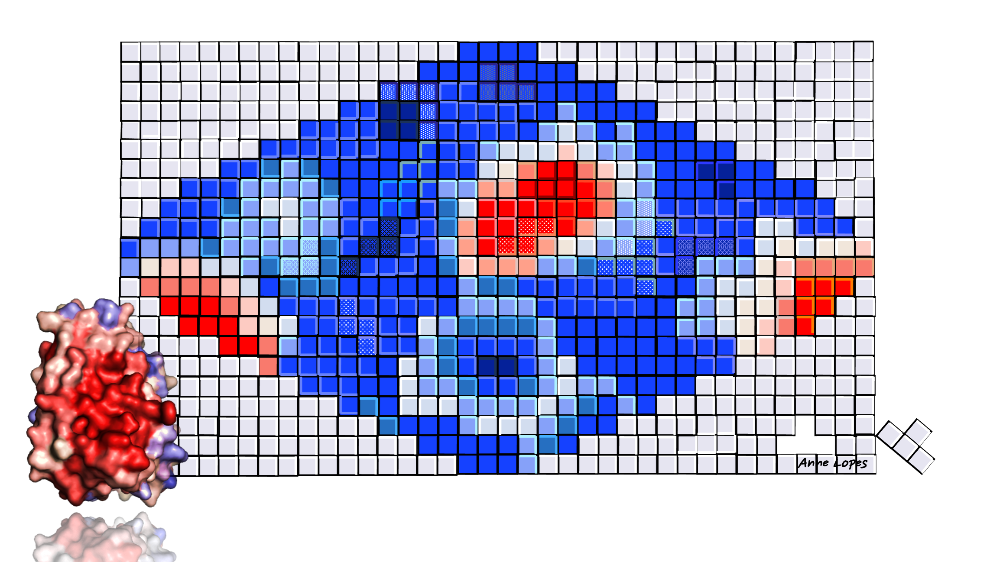

<div align="center">

  <a></a>
  <a></a>
  <a></a>
  <a></a>
  <a></a>


  
  
  <!-- <br> -->

  <!-- 
  
  
   -->
</div>

---

# SURFMAP

<div align="center">
    
</div>

# Table of contents

- [Aims](#Aims)
- [Installation](#Installation)
- [How it works](#How-it-works)
- [Usage of SURFMAP](#Usage-of-SURFMAP)
- [How to cite SURFMAP](#How-to-cite-SURFMAP)

# Aims
[Go to the top](#Table-of-contents)

<div>


SURFMAP is a free standalone and easy-to-use command-line interface (CLI) software that enables the fast and automated 2D projection of either predefined features of protein surface (electrostatic potential, Kyte-Doolittle hydrophobicity, Wimley-White hydrophobicity, stickiness and surface relief) or any descriptor encoded in the temperature factor column of a PDB file. The 2D maps computed by SURFMAP can be used to analyze and/or compare protein surface properties.
</div>


# Installation
[Go to the top](#Table-of-contents)

### Requirements

SURFMAP is a CLI tool that requires a UNIX-based OS system. It is written in python (version 3.7), R (version 3.6). It relies on the already included MSMS software ([1](#ref-1)) and may optionally require APBS ([2](#ref-2)) if the user wants to perform electrostatics calculations.

All those requirements (including APBS) are met in a [predefined Docker image](https://hub.docker.com/r/lopesi2bc/surfmap/tags) that we recommend the user to use. 

<details open>
<summary><b>For a usage of the docker image</b></summary>

- an UNIX-based OS system (any linux distribution, a MacOS system or [WSL2](https://learn.microsoft.com/fr-fr/windows/wsl/install) on windows)
- [Python >= 3.7](https://www.python.org/downloads)
- [Docker](https://docs.docker.com/get-docker/)

</details>

<details>
<summary><b>For a usage on your local OS</b></summary>

- an UNIX-based OS system (any linux distribution, a MacOS system or [WSL2](https://learn.microsoft.com/fr-fr/windows/wsl/install) on windows)
- [Python >= 3.7](https://www.python.org/downloads)
- [R >= 3.6](https://cran.r-project.org/)
- [APBS](https://github.com/Electrostatics/apbs/releases) (optional - only if you want to compute electrostatic potential)
 
</details>

**Please also note that whether you want to use the Docker image of SURFMAP or not, you will still need to [install the SURFMAP package](#install_option1)**. Indeed the package contains internal features that make the use of the Docker image totally transparent for the user who will not have to enter 'complex' commands for the connection of useful mounting points. In fact, the SURFMAP commands are almost exactly the same between the use of the docker image or not (see [here](#cmd_docker_or_not)).


### Recommendation

We strongly recommend that you install the SURFMAP package and its python dependencies in an isolated environment. Click in the section below for a short illustration on why and how to use an isolated environment.

<details style="margin-left: 32px">
<summary>How to use an isolated environment (recommended)</summary>
<br>
<p>
By using an isolated environment you will avoid potential version conflicts between python libraries when working on different projects. Some of the most popular tools to work with isolated python environments are [virtualenv](https://pypi.org/project/virtualenv/), [pyenv](https://pypi.org/project/pyenv/), [pipenv](https://pypi.org/project/pipenv/). 
</p>

Below is an example on how to use [virtualenv](https://pypi.org/project/virtualenv/).

#### 1. Install virtualenv
```bash
# upgrade pip to its latest version
python3 -m pip install --upgrade pip

# install virtualenv
python3 -m pip install virtualenv
```

#### 2. Create and activate an isolated environment
```bash
# create an isolated environment named 'myenv' (to adapt)
virtualenv myenv

# activate your isolated environment
source myenv/bin/activate
```

Once activated, any python library you'll install using pip will be installed in this isolated environment, and python will only have access to these packages.

Once you're done working on your project, simply type `deactivate` to exit the environment.
</details>


## How to install SURFMAP
[Go to the top](#Table-of-contents)

First, make sure you meet the [system requirements](#requirements) outlined earlier and consider the [recommendation](#recommendation). Then, follow instructions described in option 1 or 2 if you're not interested in accessing/modifying the source code, otherwise prefer option 3. 

<a id="install_option1"></a>
<details open>
<summary><h4>Option 1: from the archive (git not required)</h4></summary>

First download an archive of our latest release <a href="https://github.com/i2bc/SURFMAP/releases/latest" target="_blank">here</a>.

```bash
# upgrade pip to its latest version
python3 -m pip install --upgrade pip

# install SURFMAP v2.0.0
python3 -m pip install SURFMAP-v2.0.0.zip # (or .tar.gz) 
```
</details>


<details>
<summary><h4>Option 2: from the version control systems</h4></summary>

```bash
# upgrade pip to its latest version
python3 -m pip install --upgrade pip

# install SURFMAP v2.0.0
python -m pip install -e git+https://github.com/i2bc/SURFMAP.git@v2.0.0#egg=surfmap
```
</details>

<details>
<summary><h4>Option 3: from this project repository</h4></summary>

```bash
# clone SURFMAP on your machine
git clone https://github.com/i2bc/SURFMAP.git

# go in the SURFMAP/ directory
cd SURFMAP

# upgrade pip to its latest version
python3 -m pip install --upgrade pip

# install SURFMAP
python3 -m pip install -e .
```
</details>


# How it works
[Go to the top](#Table-of-contents)


### SURFMAP workflow: inputs/outputs

<div align="center">
  

<i>The figure above represents the main steps of the SURFMAP worflow to compute the projection on a 2D map of a protein surface feature. More details about each step can be found in [our article](https://pubs.acs.org/doi/10.1021/acs.jcim.1c01269).</i>
</div>
<br>

SURFMAP accepts as input either a *PDB file* or a *text file in a SURFMAP-specific matrix format*.
<br>
<br>

[Using a PDB file as input](#from-a-pdb-structure) is the most classic usage of SURFMAP. In this case, two outputs are generated: 
- the 2D map projection in a PDF format (PNG is also available)
- a matrix text file written in a SURFMAP-specific format

The matrix text file contains all information about each projected surface residue and their associated feature value. As the above figure shows, this text file is the direct input for the last step of the SURFMAP workflow as it is read to generate the 2D map projection.
<br>
<br>

[Using a text file in a SURFMAP-specific matrix format as input](#from-a-surfmap-matrix-file) represents a special case that could be useful if the user wants to generate a 2D map from an internally pre-processed matrix, such as to normalize or average with other matrices.

<details>
<summary>Example of a SURFMAP-specific matrix format (.txt)</summary>

<pre>absc    ord     svalue  residues
5       5       Inf     NA
5       10      Inf     NA
5       15      Inf     NA
...
5       80      Inf     GLU_120_A
5       85      Inf     GLU_120_A, GLN_301_A
5       90      Inf     GLN_301_A
5       95      Inf     GLN_301_A
5       100     Inf     GLN_301_A
5       105     Inf     GLN_301_A
...
360	175	Inf	NA
360	180	Inf	NA
</pre>
</details>


### Calling SURFMAP with Docker or not

Whether you want to use SURFMAP through a Docker or not, the commands are almost exactly the same. Indeed, in order to use the Docker image of SURFMAP, you will just have to add the CLI option **`--docker`**. If you want to use SURFMAP from an installation on your local OS, then simply remove this option. For example:

<a id="cmd_docker_or_not"></a>

```bash
# a command that will run on a Docker container
surfmap -pdb foo.pdb -tomap stickiness --docker

# the same command that will run on your local OS
surfmap -pdb foo.pdb -tomap stickiness
```

If the Docker image of SURFMAP is missing from your system, it will be automatically downloaded the first time you will execute a SURFMAP command.

The version of the SURFMAP Docker image used is the same as the version of SURFMAP you will have installed. You can check your current version with the command `surfmap -v`. Yet if you want to use [another version of the SURFMAP Docker image](https://hub.docker.com/r/lopesi2bc/surfmap/tags), you will have to set a `SURFMAP_DOCKER_VERSION` environment variable with a value corresponding to an available tag version:

```bash
# set SURFMAP_DOCKER_VERSION to 2.0.0 for using the SURFMAP Docker image tagged 2.0.0
export SURFMAP_DOCKER_VERSION=2.0.0 
```


# Usage of SURFMAP
[Go to the top](#Table-of-contents)

Once you have [installed the SURFMAP package](#how-to-install-surfmap), you should be ready to use SURFMAP. 

#### The example directory
To guide the user in the usage of SURFMAP, we will make use of files that you can find in the `example/` directory of SURFMAP. You can see where this directory is located on your machine with the following command:

```bash
python3 -c "import surfmap; print(surfmap.PATH_TO_EXAMPLES)"
```

Please note that for all command examples illustrated below, we will make [use of the Docker image of SURFMAP](#use-surfmap-with-docker-or-not).


## Projection of a protein surface feature on a 2D map

In order to generate a 2D map projection of a protein surface feature, two inputs are required:
- either a PDB file (`-pdb` option) OR a matrix text file written in a SURFMAP-specific format (`-mat` option)
- a valid key referring to a feature to map (listed in the table below)

| Valid feature key | Feature details |
| --- | --- |
`kyte_doolittle` | Residue hydrophobicity directly derived from the Kyte-Doolittle scale ([3](#ref-3))
`wimley_white` | Residue hydrophobicity directly derived from the Wimley-White scale ([4](#ref-4))
`stickiness` | Propensity of each amino acid to be involved in protein−protein interfaces ([5](#ref-5))
`circular_variance` | Descriptor of the local (residue scale) geometry of a surface region: low values reflects protruding residues, while high values indicates residues located in cavities ([6](#ref-6))
`circular_variance_atom` | Descriptor of the local geometry (atomic scale) of a surface region: low values reflects protruding atoms, while high values indicates atoms located in cavities. ([6](#ref-6))
`electrostatics` | Electrostatic potential of the protein surface (atomic scale) - Requires the APBS software ([2](#ref-2))
`bfactor` | Any feature stored in the temperature factor of the input PDB file
`all` | Compute sequentially the following features: `kyte_doolittle`, `wimley_white`, `stickiness` and `circular_variance`

#### From a PDB structure

```bash
# example - command to map the stickiness values for residues at the surface of the chain A of 1g3n.pdb
surfmap -pdb 1g3n_A.pdb -tomap stickiness --docker
```

The output has the following structure and content:
<pre><font color="#12488B"><b>output_SURFMAP_1g3n_A_stickiness/</b></font>
├── <font color="#12488B"><b>maps</b></font>
│   └── 1g3n_A_stickiness_map.pdf
├── parameters.log
├── surfmap.log
└── <font color="#12488B"><b>smoothed_matrices</b></font>
    └── 1g3n_A_stickiness_smoothed_matrix.txt
</pre>

with:
- `parameters.log`: a summary of the parameters used to compute the map
- `surfmap.log`: a log file of each of the step of the SURFMAP workflow
- `1g3n_A_stickiness_map.pdf`: the generated 2D map in PDF format
- `1g3n_A_stickiness_smoothed_matrix.txt`: a computed smoothed matrix file (txt file) used to generate the 2D map. This matrix has the expected format of a matrix file that can be used as a direct input of SURFMAP through the used of the `-mat` argument.


<details>
<summary><h5>Note on electrostatics calculations</h5></summary>

The electrostatics potential is calculated through the use of APBS and is initially based on the generation of a PQR file which will contain the charge and radius of each atom in the input PDB file. In SURFMAP, this PQR file is generated through the use of [pdb2pqr](https://pdb2pqr.readthedocs.io/en/latest/) which reads atomic parameters from a force field accessible from its package itself. While the CHARMM force field is used by default in SURFMAP, all force fields accessible in pdb2pqr (AMBER, CHARMM, PARSE, TYL06, PEOEPB, SWANSON) can be used in SURFMAP with the `-ff` option. For example:

```bash
# will use the CHARMM force-field (default)
surfmap -pdb 1g3n_A.pdb -tomap electrostatics --docker

# will use the AMBER force-field
surfmap -pdb 1g3n_A.pdb -tomap electrostatics -ff AMBER --docker
```

For the particular case where a user would like to compute electrostatics potential with any other force-field (e.g. for a coarse-grained PDB file), SURFMAP can be used with the additional option `-pqr` that must be followed with a PQR file generated by the user himself. For example:

```bash
# will read atomic parameters from the PQR given as input
surfmap -pdb structure.pdb -tomap electrostatics -pqr structure.pqr --docker
```

</details>


#### From a SURFMAP matrix file

A matrix written in a SURFMAP-specific format can also be used as an input to generate a 2D map. The feature to map has to be the same as the one used to generate the matrix file. As a fancy usage example, the command below will reproduce the 2D map generated from the command above:

```bash
# example - command to create a map from a SURFMAP matrix file generated with stickiness values
surfmap -mat output_SURFMAP_1g3n_A_stickiness/smoothed_matrices/1g3n_A_stickiness_smoothed_matrix.txt -tomap stickiness --docker
```

A more realistic usage of this option would be to compute maps from your internally pre-processed matrices. For example you may have generated 2D maps of a same protein in different conformational states and then may want to compute an averaged matrix file (please note that we don't provide such script utilities).

<details>
<summary><b>Example of a SURFMAP-specific matrix format (.txt)</b></summary>

<pre>absc    ord     svalue  residues
5       5       Inf     NA
5       10      Inf     NA
5       15      Inf     NA
...
5       80      Inf     GLU_120_A
5       85      Inf     GLU_120_A, GLN_301_A
5       90      Inf     GLN_301_A
5       95      Inf     GLN_301_A
5       100     Inf     GLN_301_A
5       105     Inf     GLN_301_A
...
360	175	Inf	NA
360	180	Inf	NA
</pre>
</details>


## Projection of interface residues on a 2D map

<p></p>

Instead of projecting a protein surface feature on a 2D map, you may be interested in the projection of interface residues. This is possible with the option `-tomap binding_sites` of SURFMAP. 

With the `-tomap binding_sites` option, a discrete color scale is used to associate one color to each different value found in the b-factor column. So in order to use this option, your input PDB file must contain discrete values in the b-factor column for each atoms, the value depending on whether the atoms belong to an interface or not. For example:
- `0` for atoms that are not part of any binding sites
- `1` for atoms being part of one known binding site
- `2` for atoms being part of a second binding site (if there is)
- `...`


We provide two utility scripts to help users generating a PDB file that can be used with the `-tomap binding_sites` option of SURFMAP:
- `extract_interface`
- `write_pdb_bs`

##### Usage of extract_interface

From multi-chain PDB file, the command `extract_interface` will find the interface residues between a given chain (or set of chains) and all the other chains of the input PDB structure. It will then output a new PDB file of the given chain(s) with the expected format for the `-tomap binding_sites` option.

The command below illustrates the usage of `extract_interface` with the PDB file `1g3n_ABC.pdb` in the example directory. 

```bash
# generate a PDB file of the chain A in which the b-factor column will contain a discrete value for each different interface residues that will be found between chains A and B, and chains A and C
extract_interface -pdb 1g3n_ABC.pdb -chains A
```

It will generate two output files:
- `1g3n_ABC_chain-A_bs.pdb`: a PDB file ready for use by the command `surfmap` with the option `-tomap binding_sites`.
- `1g3n_ABC_chain-A_interface.txt`: a text file containing information about identified interface residues. This file can be edited and used as input for the command `write_pdb_bs` described below.


So now, we can map interface residues of the chain A of 1G3N:
```bash
# Use the PDB file generated with the command above to project labelled residues on a 2D map 
surfmap -pdb 1g3n_ABC_chain-A_bs.pdb -tomap binding_sites
```

##### Usage of write_pdb_bs

The command `write_pdb_bs` is made to avoid the manual editing of the b-factor column of a PDB file that you would like to use with the `-tomap binding_sites` option. The command takes as inputs:
- a PDB file of interest
- a text file listing interface residues of interest

The text file listing interface residues must be formatted as follows:
- 1st column: the chain name that has an interface residue
- 2nd column: a residue ID
- 3rd column: a residue name
- 4th column: a discrete value (one value per different binding site)

For example, if you want to map the residues GLU-14 and CYS-15 of the chain A as part of an interface, and the residues GLY-50 and GLU-51 of the chain A as part of another interface, you should create your input file as follows:
```
A	14	GLU	1
A	15	CYS	1
A	50	GLY	2
A	17	GLU	2
```

As a fancy example, the command below will reproduce the PDB file `1g3n_ABC_chain-A_bs.pdb` ready for use by `surfmap` with the option `-tomap binding_sites`:
```bash
write_pdb_bs -pdb 1g3n_ABC_chain-A_bs.pdb -res 1g3n_ABC_chain-A_interface.txt
```

The output file will have the basename of the PDB file given as input with the suffix `_bs.pdb`


# How to cite SURFMAP
[Go to the top](#Table-of-contents)

If SURFMAP has been useful to your research, please cite us as well as the original MSMS paper:

> Hugo Schweke, Marie-Hélène Mucchielli, Nicolas Chevrollier, Simon Gosset, Anne Lopes. SURFMAP: a software for mapping in two dimensions protein surface features. J. Chem. Inf. Model. 2022. [Link](https://pubs.acs.org/doi/10.1021/acs.jcim.1c01269)

> Sanner, M. F., Olson A.J. & Spehner, J.-C. (1996). Reduced Surface: An Efficient Way to Compute Molecular Surfaces. Biopolymers 38:305-320. [Link](https://doi.org/10.1002/(sici)1097-0282(199603)38:3%3c305::aid-bip4%3e3.0.co;2-y)
<br>

Moreover, if you use APBS in your research, please cite one or more of the following papers listed in the [Supporting APBS](https://apbs.readthedocs.io/en/latest/supporting.html) documentation page.
<br>

# References
[Go to the top](#Table-of-contents)

<a id="ref-1"></a>

> (1) Michel Sanner, Arthur J. Olson, Jean Claude Spehner (1996). Reduced Surface: an Efficient Way to Compute Molecular Surfaces. Biopolymers, Vol 38, (3), 305-320.


<a id="ref-2"></a>

> (2) Jurrus E, Engel D, Star K, Monson K, Brandi J, Felberg LE, Brookes DH, Wilson L, Chen J, Liles K, Chun M, Li P, Gohara DW, Dolinsky T, Konecny R, Koes DR, Nielsen JE, Head-Gordon T, Geng W, Krasny R, Wei GW, Holst MJ, McCammon JA, Baker NA. Improvements to the APBS biomolecular solvation software suite. Protein Science, 27, 112-128, 2018.


<a id="ref-3"></a>

> (3) Kyte, J.; Doolittle, R. F. A Simple Method for Displaying the Hydropathic Character of a Protein. J. Mol. Biol. 1982, 157 (1), 105−132.


<a id="ref-4"></a>

> (4) Wimley, W. C.; White, S. H. Experimentally Determined Hydrophobicity Scale for Proteins at Membrane Interfaces. Nat. Struct. Biol. 1996, 3 (10), 842−848.


<a id="ref-5"></a>

> (5) Levy, E. D. A Simple Definition of Structural Regions in Proteins and Its Use in Analyzing Interface Evolution. J. Mol. Biol. 2010, 403 (4), 660−670.


<a id="ref-6"></a>

> (6) Mezei, M. A New Method for Mapping Macromolecular Topography. J. Mol. Graph. Model 2003, 21 (5), 463−472.
